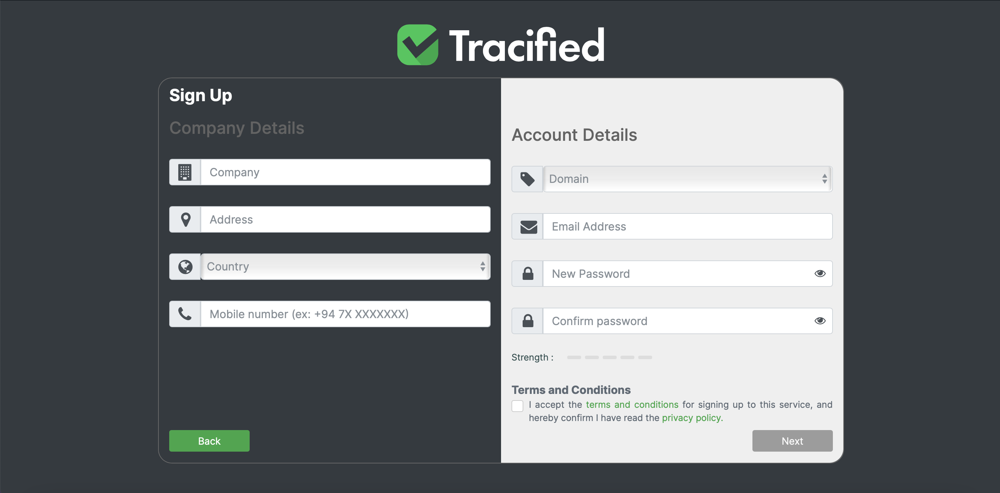

# How to create accounts

User account creation in Tracified is a simple and a user friendly process. As the first step after subscribing, users should be able to create blockchain accounts through the Tracified Admin Portal. 

Creation of both Blockchain accounts and Tracified Accounts can be done here. User has to fill in all the input fields correctly in both company details and account details sections. The Company Name should be a valid name, Address should be correct  and they cannot be kept empty. Once the user selects the country, the system will automatically populate the country code in the contact number field. The user can then fill in the remaining digits accurately.

In the **“Account Details”** section, the user should select the relevant domain, insert a valid email address, type a username and define a password that is strong enough. Once all the fields are correctly filled, the user has to tick off the checkbox to accept the Tracified Terms and Conditions. 
Then the user should click on the ‘Next’ button to proceed using Tracified. 

