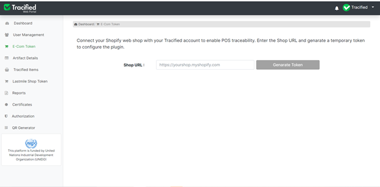

# Ecom token

import DocsRating from '@site/src/core/DocsRating';

[`Tracified-Items`](./tracifiedItems) [`Lastmile-Token`](./LastmileToken)

The shopify webshop and the Tracified account can be connected by providing the shop URL. The shop URL can be obtained from your shopify account and once it is correctly inserted and submitted, the plugin will be configured by generating a key and it will enable the POS traceability.

:white_check_mark: Getting the token and applying that to the shopify web shop

<DocsRating pageName="Ecom Token" />
