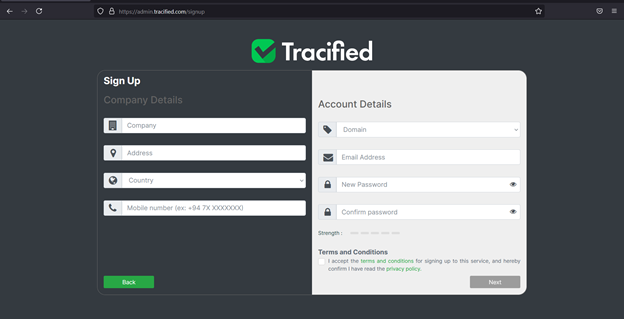
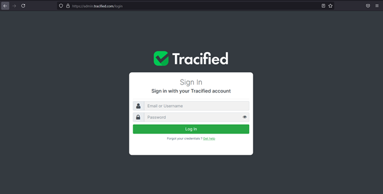
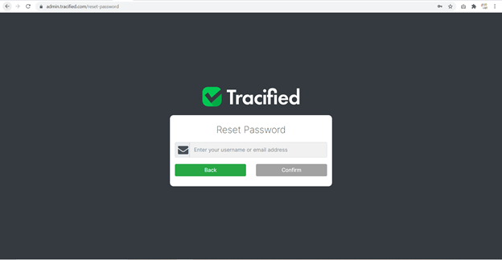

# Getting Started

import DocsRating from '@site/src/core/DocsRating';

[`Tracified-Items`](./tracifiedItems) [`Artifacts`](./artifactDetails) [`Ecom`](./Ecom) [`Lastmile-Token`](./LastmileToken)

The Admin Portal of Tracified is responsible for the management of users, accounts, Tracified items, artifact details, shop tokens, reports, certificates and generating QR codes.

## Sign Up

The sign up process for the Admin Portal involves a simple procedure, where the user needs to enter the required details. The company details should be provided as per the organization and account details should be filled by selecting the domain monitored by the organization and by providing a valid email address and a reliable password. Once all the pertinent fields are filled accurately and the ‘Terms and Conditions’ are accepted, the user will be successfully signed up as an administrator to Tracified.

## Login

A user who has already registered, can log in to the portal, providing either their username or email address along with the correct password.

If the password is forgotten, the user can reset it, through the ‘get help’ option.

The user should enter either username or the used email address and once confirmed, a password reset link will be sent to the appropriate email. Then he/she can set a new password and continue using the portal.

<DocsRating pageName="Sign UP"/>
