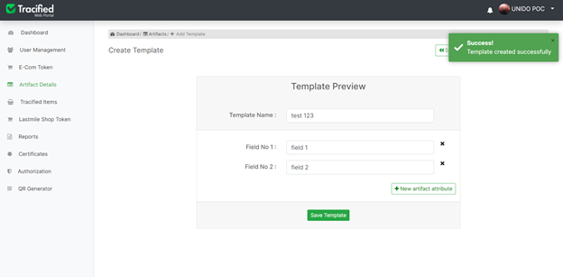

# Artifact details
import DocsRating from '@site/src/core/DocsRating';

[`Tracified Configs- Artifacats`](../TracifiedConfigs/artifacts) [`Field Officer App- Master Data`](../FOapp/upadteMasterData)

[Master Data](../intro#artifacts--master-data) are referred to as [Artifacts](../intro#artifacts--master-data) in Tracified. [Artifacts](../intro#artifacts--master-data) can be created here, as per the requirement. 
New artifact templates can be defined through the ‘New Template’ button.

An appropriate artifact name can be used here and then new artifact attributes should also be added as required. 

Make sure, at least one attribute is defined for each artifact and many field names can be defined here as per the requirement.

Once all the data is added and saved, the template will be successfully created and an alert will show up, notifying the user the successful completion of the 
action performed.

Already created and saved artifact templates can also be viewed, in order to know how and what should be done in creating the [artifacts](../intro#artifacts--master-data).  

:white_check_mark: If they are appropriate, they can be used to proceed, instead of creating new [artifacts](../intro#artifacts--master-data)

Previously created and saved templates can be used to proceed, instead of creating new [artifacts](../intro#artifacts--master-data), if they are appropriate.
[Artifacts](../intro#artifacts--master-data) can also be deleted if they are inappropriate or not in use anymore. Once the delete alert is confirmed, the selected artifact will be completely deleted and will no longer be available to use. 

Once an artifact is selected to be used, the list of already saved records(refed as [master Data](../intro#artifacts--master-data)) will be published. You can add new records by clicking on the ‘+ New Record’ button and all text fields must be filled in order to save the record successfully. 
Tracified Admin Portal also allows uploading a CSV file in the given format, and once it is correctly uploaded, the artifact will be saved automatically.

<DocsRating pageName="artifactDetails"/>

