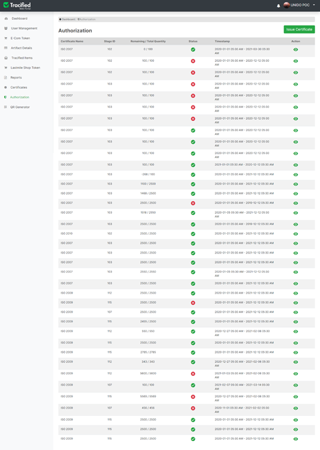
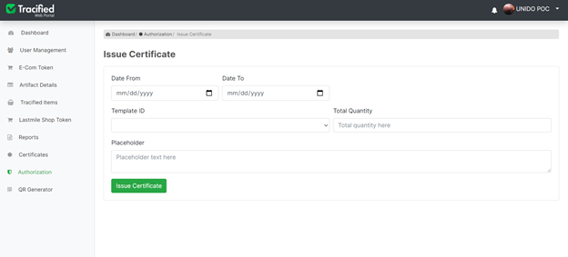

# Authorization

import DocsRating from '@site/src/core/DocsRating';

[`Certifications`](../TracifiedAdmin/certificates)

- Certificate Name, Stage ID, Remaining and Total Quantities, Status of the certificate, Validity duration of the certificate can be viewed through this.

- New certificates can be issued, by clicking on the ‘New Certificate’ button.

The date ranges from which date the certificate is issued and to which date the certificate will be valid, should be selected, then the relevant template ID should be selected from the pre-defined templates, the total quantity of the product should be entered and any description about the certificate to be issued can also be added. Once all the fields are correctly filled, and clicked on the **‘Issue Certificate’ **button, all data will be successfully saved and the certificate will be issued.

<DocsRating pageName="authorization"/>
