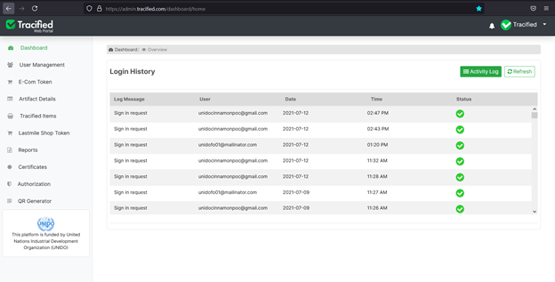
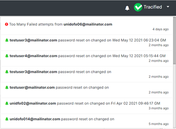
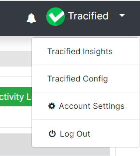

# Dashboard

import DocsRating from '@site/src/core/DocsRating';

[`Tracified-Configs`](../TracifiedConfigs/Intro) [`Tracified-Insights`](../TracifiedInsights/home) 

After a successful login, the main dashboard will be displayed. The login history and the activity log can be viewed using this interface. All the past logins from each account, the time and date as well as the record of activities done from each account will be displayed here

Admin portal also notifies and updates the logged in user about any activity and lets the user know that something new has happened, so they don’t miss anything that might be worth paying attention to.

The menu at the top right corner of the UI is a collapsible dropdown, which consists of direct links to other web portals of Tracified, user account setting and also the option to logout from the account.

<DocsRating pageName="dashboard" />
