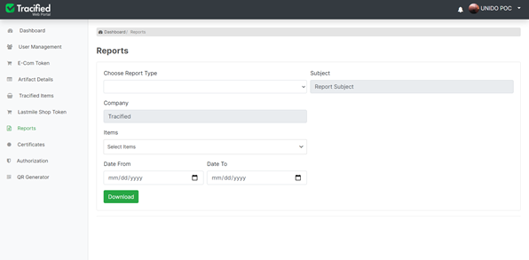

# Reports

import DocsRating from '@site/src/core/DocsRating';

Different types of system generated reports are available, which can be obtained based on the requirement. Reports types include;** Quantity of Production, Exported Production, Consumer Review, Test specifications, Efficiency of Production, Processed Quantity, Harvested Farm Size, Farmer Rating, Overall Rating, Farm Certification etc. **
Reports can be obtained by selecting the product(s) within a selected date range .

A preview of the generated report will be displayed at the bottom section of the page, while it will also be available to downloaded as a PDF file.

<DocsRating pageName="reports"/>
