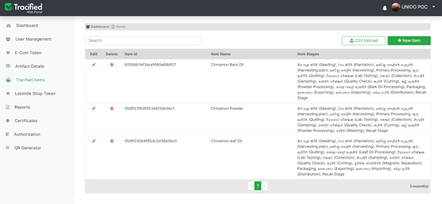
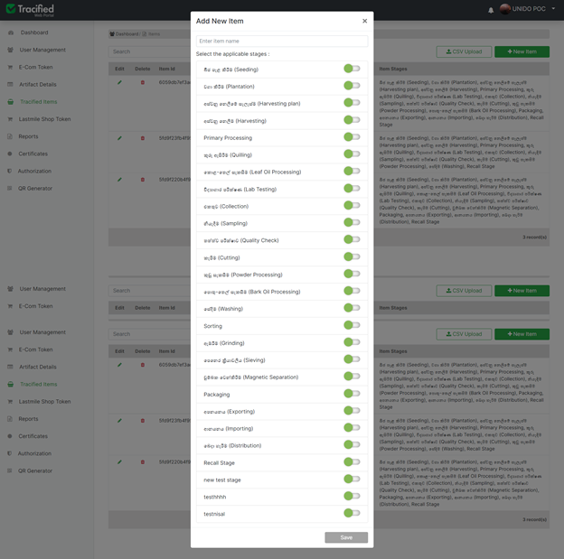

# Tracified Items

[`Field officer App- UpdateMasterData`](../FOapp/upadteMasterData)

import DocsRating from "@site/src/core/DocsRating";
import ObsoleteDoc from "@site/src/core/MarkObsolete";

- Items available in the Tracified record systems can be viewed through the **"Tracified Items"** page. It contains the item ID, item name and the [stages](../intro#stage) which are included in the supply process of each item.

- New items can be added to the system through the **“+ New Item”** button. The new items can be given new names and the required [stages](../intro#stage) can be selected through the toggle buttons and can be saved successfully.

- Existing items can be edited or deleted; but only the Item Name and the [stages](../intro#stage) can be changed and updated.

<DocsRating pageName="Tracified Items" />
