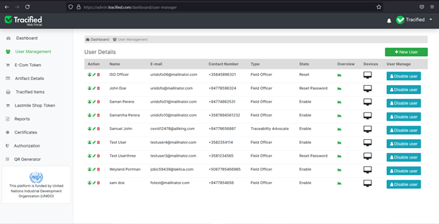
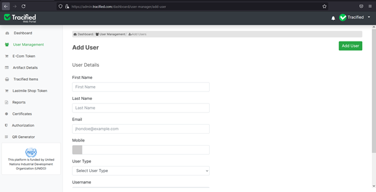
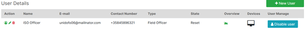

# User Management

import DocsRating from '@site/src/core/DocsRating';

[`Getting Started`](./SignUp) [`Authorization`](./authorization)

All the user details related to the logged in user will be displayed through this.

A new user can be added by filling all the fields and once the Add User button is clicked, the new user will be added.

Existing user details can be viewed through the user icon in the action column.
The user details can be edited or deleted using the edit and delete icons in the action column.
The user behaviour for the past logged days can be viewed through the overview of each user.
The device remembrance records details about the devices, user used to log in.
Each user account can be disabled through the ‘Disable User’ button.

<DocsRating pageName="User Managment"/>
