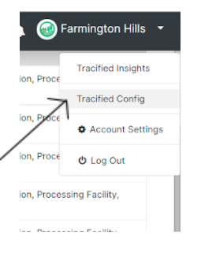

# Configure Tracified

import DocsRating from '@site/src/core/DocsRating';

[`Tracified Admin- TracifiedItems`](../TracifiedAdmin/tracifiedItems) [`Tracified Admin- Getting Started`](../TracifiedAdmin/SignUP)


- Tracified Configs Portal can be accessed via the Tracified Admin.



Tracified configs will be where the configurations made by the users to augment the system to their supply chain. This includes storage of [workflow](../intro#workflow) and [artifact](../intro#artifacts--master-data) configurations and Field Officer user interfaces. Tracified will allow the users to create their [workflows](../intro#workflow)  ** through two options**.

```
1. Using sample workflow and artifact templates.

2. Creating workflows manually.

```

Lets add the option auto generate or manual creation.

When creating the [workflows](../intro#workflow) manually, [artifacts](../intro#artifacts--master-data) should be defined first.

<DocsRating pageName="certificates"/>
