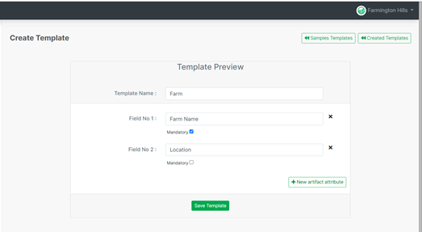
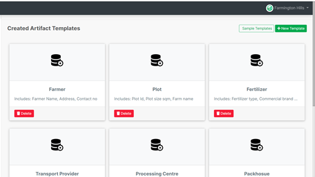

# Artifacts

import DocsRating from '@site/src/core/DocsRating';

Entities are referred to as Artifacts in Tracified. (ex: Farmer, Farm, Processing Center, Plot etc)

New artifact templates can be defined through the ‘New Template’ button.

An appropriate artifact name can be used here and then new artifact attributes should also be added as required.

Make sure, at least one field is defined for each artifact and you can have any number of fields defined here for an artifact as per the requirement.

Once all the data is added and saved, the template will be successfully created and an alert will show up, notifying the user the successful completion of the action performed.

<DocsRating pageName="certificates"/>
