# Recall Management
import DocsRating from '@site/src/core/DocsRating';

[`User Management`](../TracifiedAdmin/userMangement)

:::note What are prerequisites for recall functionality?

When defining the ‘workflow’ there should be a final stage named ‘Recall Stage’ 	

:::

:::note How to recall?

Recall Management comprises four main functionalities. 

:::

## Recalls

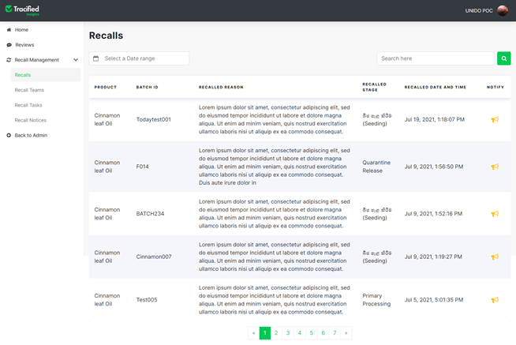

Already recalled products will be displayed in the table grid along with the details such as Batch ID, recalled reason, stage and date and time of recall. 

Previously recalled batches can be searched by the recall name or filter the batches which have been recalled during a particular period of time through the date range filter option. 

Recalls can be notified through the *yellow speaker icon* at the last column of each recalled product. 

## Recall Notices

Notices about each recalled product can be created here using the icon at the ‘Notify’ column. 

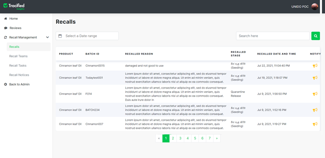

Once clicked on the icon, you will be shown a pop up window to add the recall notice.

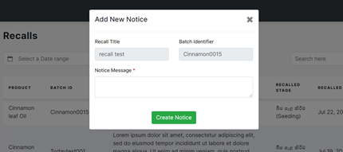

Then the Recall Title and Batch Identifier will be auto retrieved from the system and filled, only the required notice can be typed and saved.
A meaningful notice should be created conveying the receivers about the recall and its gravity. 

## Recalling a product

In order to recall the required product, you should select the item, its and it's batch as in ** “Selecting an item”** and ** “Selecting a batch”**. To recall the selected batch go to ‘View Traceability Data’ and click on the three dots.

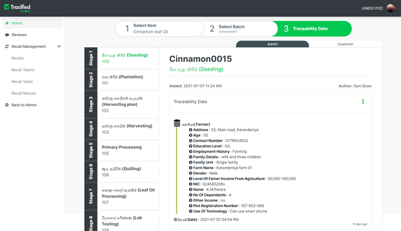

Click on the **“Recall this batch” ** button.

Then an alert will pop up, asking you to confirm the action. 
Make sure you are so certain about this action as it is serious and cannot be reversed. 

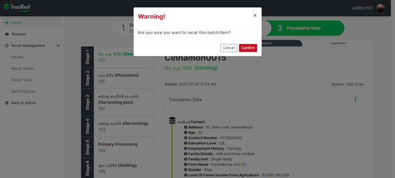

Once you click on the ‘Confirm’ button, you will get to fill a simple form including required details. 
If you don’t wish to proceed with this action of recalling, you can still choose the ‘Cancel’ option to terminate. 

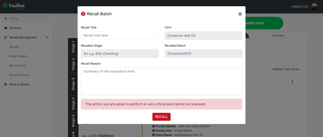

If you continue recalling the batch, fill in the fields in white by adding an appropriate name for the recall and also by adding the reason for the recall (ex: damaged, perished etc).
Fields in grey are disables and cannot be edited as those data are retrieved from the system automatically.
Once you click on the ‘Recall’ button, the selected batch will be recalled and will be recorded as a called back item.

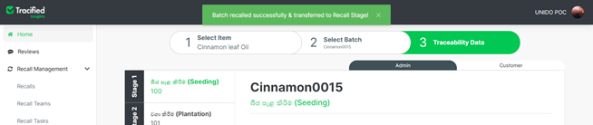

A message will be displayed, saying the recall action was successful and the batch has automatically been transferred to the recall stage.

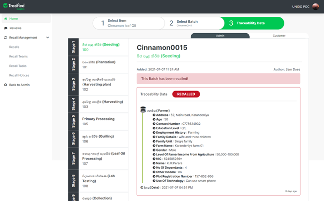

The recalled batch will be shown in red in order to let you know that there is something wrong with the particular batch

## Recall Teams

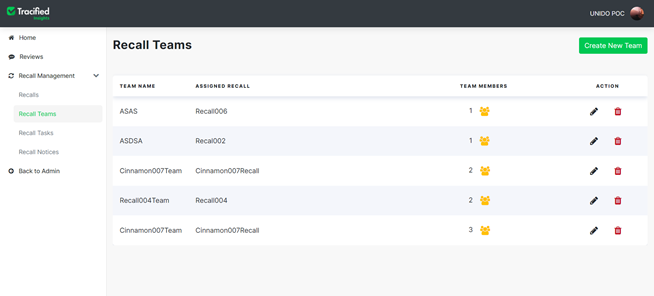

Recall Teams can be assigned to lead the recalls. Recall teams will document all recall actions, including consumer, distributor, supplier and public communications in order to reduce the risk of recall.
Any number of team members can be added to a team and those teams can be edited or deleted as per the requirement.

### Creating New Teams

New recall teams can be added by clicking on the “Create New Team” button.

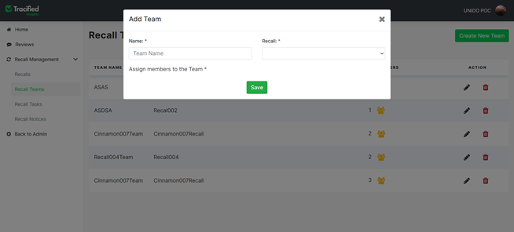 

A meaningful and an identifiable team name should be given and the related recall should be selected to the team here. Each recall team should consist of at least one member and once all those fields are correctly filled, a team will be added and details will be saved successfully. 

### Viewing the team members

Assigned team members of each team can be viewed through the yellow team button in the ‘Team Members’ column of the table.

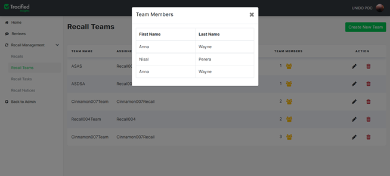 

### Editing a team

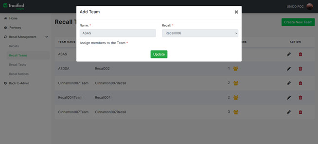

Select a team to be modified and only the number of members are allowed to be edited from a particular team. Once team members are changed or removed, and click on the “Update” button, the updated data will be saved successfully. 

### Deleting a team

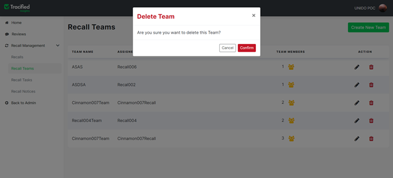

Select the team to be removed, and once confirmed the entire team will be permanently deleted from the system.  Members of the team will not be removed from the system.

### Recall Tasks 

Recall Tasks will be assigned to each recall team. The task name, description, created date and time, and the status of already recalled tasks, are displayed in the table. 
There are three states for recall tasks;

- Planned - The task is yet to be performed.
- In progress - The task is currently being worked on.
- Completed - The task has been completed successfully.

The relevant state of each task should be chosen according to the current state.

## Recall Notices

Recall team members should send follow-up recall notices to customers, distributors, suppliers and other relevant authorities in order to minimize the risk of recall. 

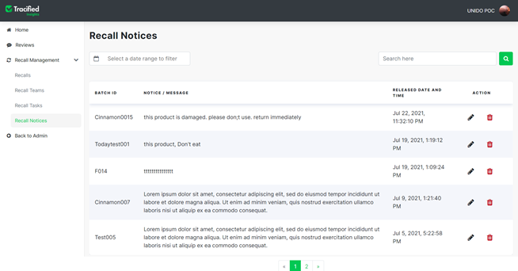

- Recall notices and their required information will be shown in the table.

- Recall notices should be sent from the ‘Notify’ option in the ‘Recall’ page.

<DocsRating pageName="certificates"/>

