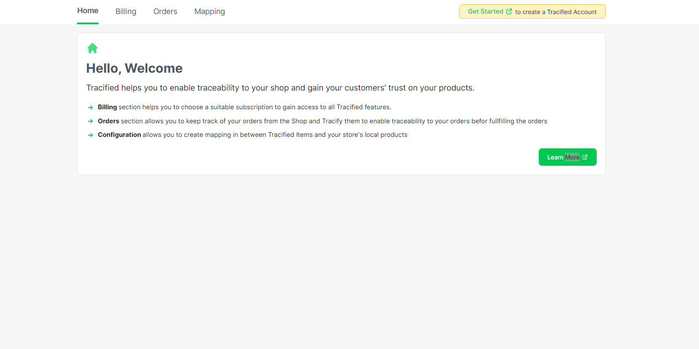
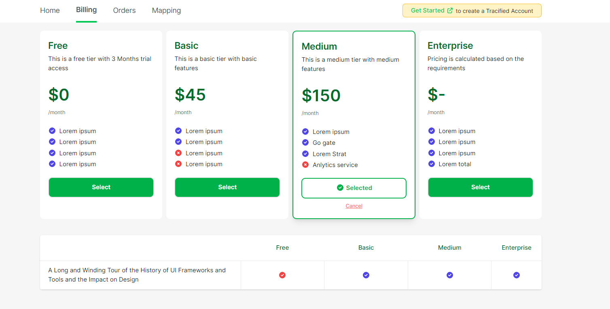
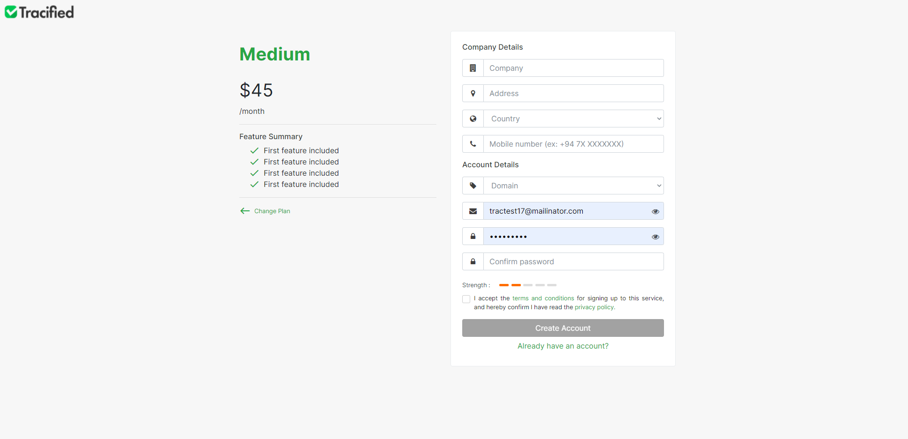

# Getting Started

There are two types of users which can subscribe to Tracified; 

- ** Ecommerce Users** -  Users who already own a shopify or woocommerce shop.
- **Non Ecommerce Users** - Users who are entirely new and who don’t own a shopify or   woocommerce shop.

Ecommerce Users can install the Tracified plugin from the Shopify Appstore and can subscribe to the Tracified Services through the billing page.

Once the appropriate tier is selected, the user can proceed by clicking on the **‘Get Started’** button. 

Then he/she will be redirected to the sign up page of Tracified. 

